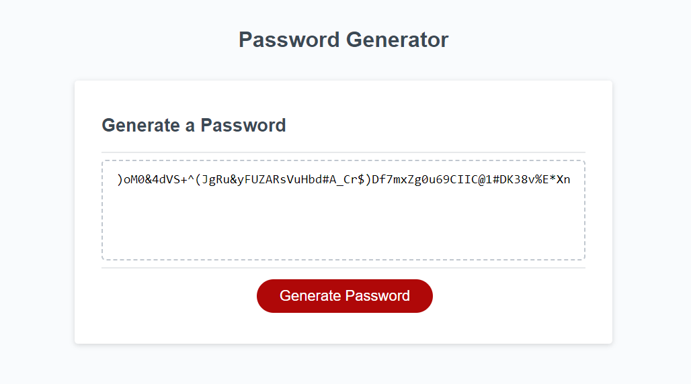

[](https://opensource.org/licenses/MIT)

# Password Generator

## Description
This project uses HTML CSS and JS to randomly create a password with specific attributes that the user specifies.

## Table of Contents
1. [Installation](#installation)
2. [Usage](#usage)
3. [Links](#links)
4. [Screenshots](#screenshots)
5. [License](#license)
6. [Questions](#questions)

## Installation
- Clone the repo down to your local machine
- Then youre good to move on to the usage

## Usage
- When installed, open the index.html in your browser
- Click the button to start the password generation
- Follow the on screen promts to use the app

### User Story

```
AS AN employee with access to sensitive data
I WANT to randomly generate a password that meets certain criteria
SO THAT I can create a strong password that provides greater security
```

### Acceptance Criteria

```
GIVEN I need a new, secure password
WHEN I click the button to generate a password
THEN I am presented with a series of prompts for password criteria
WHEN prompted for password criteria
THEN I select which criteria to include in the password
WHEN prompted for the length of the password
THEN I choose a length of at least 8 characters and no more than 128 characters
WHEN asked for character types to include in the password
THEN I confirm whether or not to include lowercase, uppercase, numeric, and/or special characters
WHEN I answer each prompt
THEN my input should be validated and at least one character type should be selected
WHEN all prompts are answered
THEN a password is generated that matches the selected criteria
WHEN the password is generated
THEN the password is either displayed in an alert or written to the page
```

## Links

[Dashboard Link](https://github.com/ThatBallinGuy/Password-Generator)

[Deployed Link](https://thatballinguy.github.io/Password-Generator/)

## Screenshots




## License
Licensed under [MIT License](https://opensource.org/licenses/MIT)

## Questions
For any questions, contact me at:
- Github: [ThatBallinGuy](https://github.com/ThatBallinGuy)
- Email: Tballin2000@hotmail.com
  